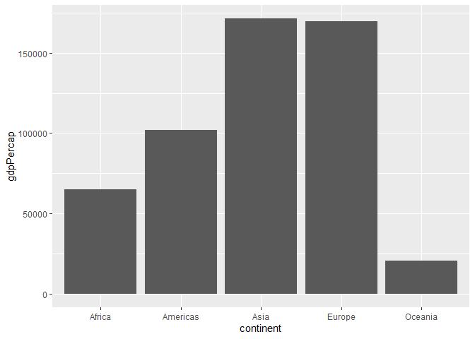
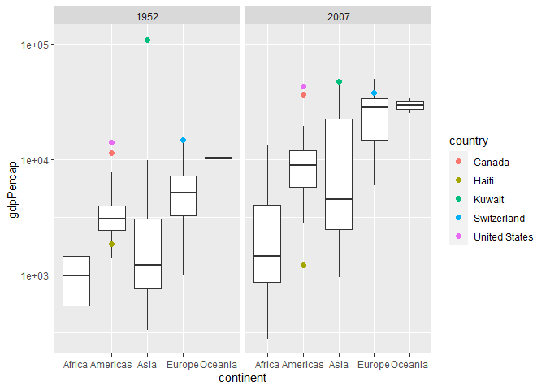
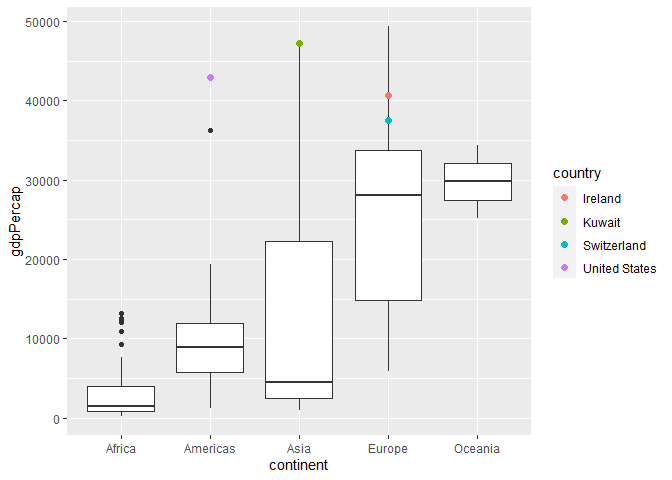
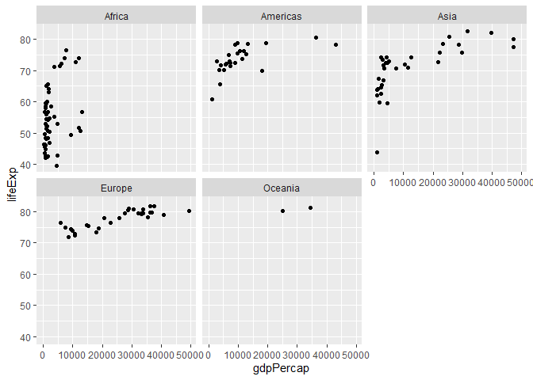
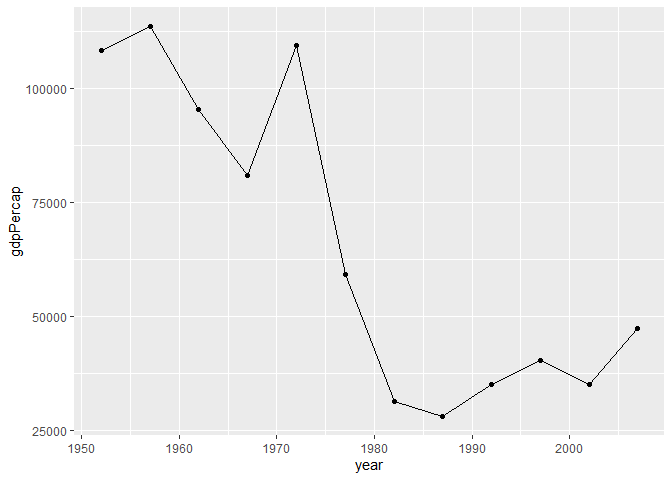
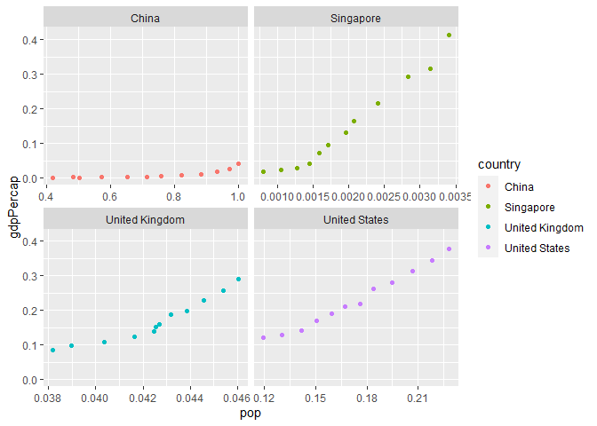

Gapminder
================
Aaron Huang
2023-2-26

- <a href="#grading-rubric" id="toc-grading-rubric">Grading Rubric</a>
  - <a href="#individual" id="toc-individual">Individual</a>
  - <a href="#due-date" id="toc-due-date">Due Date</a>
- <a href="#guided-eda" id="toc-guided-eda">Guided EDA</a>
  - <a
    href="#q0-perform-your-first-checks-on-the-dataset-what-variables-are-in-this"
    id="toc-q0-perform-your-first-checks-on-the-dataset-what-variables-are-in-this"><strong>q0</strong>
    Perform your “first checks” on the dataset. What variables are in
    this</a>
  - <a
    href="#q1-determine-the-most-and-least-recent-years-in-the-gapminder-dataset"
    id="toc-q1-determine-the-most-and-least-recent-years-in-the-gapminder-dataset"><strong>q1</strong>
    Determine the most and least recent years in the <code>gapminder</code>
    dataset.</a>
  - <a
    href="#q2-filter-on-years-matching-year_min-and-make-a-plot-of-the-gdp-per-capita-against-continent-choose-an-appropriate-geom_-to-visualize-the-data-what-observations-can-you-make"
    id="toc-q2-filter-on-years-matching-year_min-and-make-a-plot-of-the-gdp-per-capita-against-continent-choose-an-appropriate-geom_-to-visualize-the-data-what-observations-can-you-make"><strong>q2</strong>
    Filter on years matching <code>year_min</code>, and make a plot of the
    GDP per capita against continent. Choose an appropriate
    <code>geom_</code> to visualize the data. What observations can you
    make?</a>
  - <a
    href="#q3-you-should-have-found-at-least-three-outliers-in-q2-but-possibly-many-more-identify-those-outliers-figure-out-which-countries-they-are"
    id="toc-q3-you-should-have-found-at-least-three-outliers-in-q2-but-possibly-many-more-identify-those-outliers-figure-out-which-countries-they-are"><strong>q3</strong>
    You should have found <em>at least</em> three outliers in q2 (but
    possibly many more!). Identify those outliers (figure out which
    countries they are).</a>
  - <a
    href="#q4-create-a-plot-similar-to-yours-from-q2-studying-both-year_min-and-year_max-find-a-way-to-highlight-the-outliers-from-q3-on-your-plot-in-a-way-that-lets-you-identify-which-country-is-which-compare-the-patterns-between-year_min-and-year_max"
    id="toc-q4-create-a-plot-similar-to-yours-from-q2-studying-both-year_min-and-year_max-find-a-way-to-highlight-the-outliers-from-q3-on-your-plot-in-a-way-that-lets-you-identify-which-country-is-which-compare-the-patterns-between-year_min-and-year_max"><strong>q4</strong>
    Create a plot similar to yours from q2 studying both
    <code>year_min</code> and <code>year_max</code>. Find a way to highlight
    the outliers from q3 on your plot <em>in a way that lets you identify
    which country is which</em>. Compare the patterns between
    <code>year_min</code> and <code>year_max</code>.</a>
- <a href="#your-own-eda" id="toc-your-own-eda">Your Own EDA</a>
  - <a
    href="#q5-create-at-least-three-new-figures-below-with-each-figure-try-to-pose-new-questions-about-the-data"
    id="toc-q5-create-at-least-three-new-figures-below-with-each-figure-try-to-pose-new-questions-about-the-data"><strong>q5</strong>
    Create <em>at least</em> three new figures below. With each figure, try
    to pose new questions about the data.</a>

*Purpose*: Learning to do EDA well takes practice! In this challenge
you’ll further practice EDA by first completing a guided exploration,
then by conducting your own investigation. This challenge will also give
you a chance to use the wide variety of visual tools we’ve been
learning.

<!-- include-rubric -->

# Grading Rubric

<!-- -------------------------------------------------- -->

Unlike exercises, **challenges will be graded**. The following rubrics
define how you will be graded, both on an individual and team basis.

## Individual

<!-- ------------------------- -->

| Category    | Needs Improvement                                                                                                | Satisfactory                                                                                                               |
|-------------|------------------------------------------------------------------------------------------------------------------|----------------------------------------------------------------------------------------------------------------------------|
| Effort      | Some task **q**’s left unattempted                                                                               | All task **q**’s attempted                                                                                                 |
| Observed    | Did not document observations, or observations incorrect                                                         | Documented correct observations based on analysis                                                                          |
| Supported   | Some observations not clearly supported by analysis                                                              | All observations clearly supported by analysis (table, graph, etc.)                                                        |
| Assessed    | Observations include claims not supported by the data, or reflect a level of certainty not warranted by the data | Observations are appropriately qualified by the quality & relevance of the data and (in)conclusiveness of the support      |
| Specified   | Uses the phrase “more data are necessary” without clarification                                                  | Any statement that “more data are necessary” specifies which *specific* data are needed to answer what *specific* question |
| Code Styled | Violations of the [style guide](https://style.tidyverse.org/) hinder readability                                 | Code sufficiently close to the [style guide](https://style.tidyverse.org/)                                                 |

## Due Date

<!-- ------------------------- -->

All the deliverables stated in the rubrics above are due **at midnight**
before the day of the class discussion of the challenge. See the
[Syllabus](https://docs.google.com/document/d/1qeP6DUS8Djq_A0HMllMqsSqX3a9dbcx1/edit?usp=sharing&ouid=110386251748498665069&rtpof=true&sd=true)
for more information.

``` r
library(tidyverse)
```

    ## ── Attaching packages ─────────────────────────────────────── tidyverse 1.3.2 ──
    ## ✔ ggplot2 3.4.0      ✔ purrr   1.0.1 
    ## ✔ tibble  3.1.8      ✔ dplyr   1.0.10
    ## ✔ tidyr   1.2.1      ✔ stringr 1.5.0 
    ## ✔ readr   2.1.3      ✔ forcats 0.5.2 
    ## ── Conflicts ────────────────────────────────────────── tidyverse_conflicts() ──
    ## ✖ dplyr::filter() masks stats::filter()
    ## ✖ dplyr::lag()    masks stats::lag()

``` r
library(gapminder)
```

*Background*: [Gapminder](https://www.gapminder.org/about-gapminder/) is
an independent organization that seeks to educate people about the state
of the world. They seek to counteract the worldview constructed by a
hype-driven media cycle, and promote a “fact-based worldview” by
focusing on data. The dataset we’ll study in this challenge is from
Gapminder.

# Guided EDA

<!-- -------------------------------------------------- -->

First, we’ll go through a round of *guided EDA*. Try to pay attention to
the high-level process we’re going through—after this guided round
you’ll be responsible for doing another cycle of EDA on your own!

### **q0** Perform your “first checks” on the dataset. What variables are in this

dataset?

``` r
## TASK: Do your "first checks" here!
glimpse(gapminder)
```

    ## Rows: 1,704
    ## Columns: 6
    ## $ country   <fct> "Afghanistan", "Afghanistan", "Afghanistan", "Afghanistan", …
    ## $ continent <fct> Asia, Asia, Asia, Asia, Asia, Asia, Asia, Asia, Asia, Asia, …
    ## $ year      <int> 1952, 1957, 1962, 1967, 1972, 1977, 1982, 1987, 1992, 1997, …
    ## $ lifeExp   <dbl> 28.801, 30.332, 31.997, 34.020, 36.088, 38.438, 39.854, 40.8…
    ## $ pop       <int> 8425333, 9240934, 10267083, 11537966, 13079460, 14880372, 12…
    ## $ gdpPercap <dbl> 779.4453, 820.8530, 853.1007, 836.1971, 739.9811, 786.1134, …

**Observations**:

- Write all variable names here The variable names are country,
  continent, year, lifeExp, pop, and gdpPercap.

### **q1** Determine the most and least recent years in the `gapminder` dataset.

*Hint*: Use the `pull()` function to get a vector out of a tibble.
(Rather than the `$` notation of base R.)

``` r
## TASK: Find the largest and smallest values of `year` in `gapminder`
year_max <- gapminder %>%
  select(year) %>%
  max()
year_min <- gapminder %>%
  select(year) %>%
  min()
```

Use the following test to check your work.

``` r
## NOTE: No need to change this
assertthat::assert_that(year_max %% 7 == 5)
```

    ## [1] TRUE

``` r
assertthat::assert_that(year_max %% 3 == 0)
```

    ## [1] TRUE

``` r
assertthat::assert_that(year_min %% 7 == 6)
```

    ## [1] TRUE

``` r
assertthat::assert_that(year_min %% 3 == 2)
```

    ## [1] TRUE

``` r
if (is_tibble(year_max)) {
  print("year_max is a tibble; try using `pull()` to get a vector")
  assertthat::assert_that(False)
}

print("Nice!")
```

    ## [1] "Nice!"

### **q2** Filter on years matching `year_min`, and make a plot of the GDP per capita against continent. Choose an appropriate `geom_` to visualize the data. What observations can you make?

You may encounter difficulties in visualizing these data; if so document
your challenges and attempt to produce the most informative visual you
can.

``` r
## TASK: Create a visual of gdpPercap vs continent
gapminder %>%
  filter(year == year_min) %>%
  ggplot(aes(continent, gdpPercap)) +
  geom_col()
```

<!-- -->

``` r
gapminder %>%
  filter(year == year_min) %>%
  ggplot(aes(continent, gdpPercap)) +
  geom_boxplot()
```

<!-- -->

**Observations**:

- Write your observations here Asia and Europe has the highest GDP per
  cap out of all the continents followed by America, Africa, and
  Oceania. There are a few outliers in the Americas, Asia, and Europe.
  There is one significant outlier in Asia that is greatly larger than
  any other country.

**Difficulties & Approaches**:

- Write your challenges and your approach to solving them Initially I
  made a simple bar chart to get a better understanding of the data.
  Then, I created a boxplot to look at the variation in data within each
  continent.

### **q3** You should have found *at least* three outliers in q2 (but possibly many more!). Identify those outliers (figure out which countries they are).

``` r
## TASK: Identify the outliers from q2
gapminder %>%
  filter(year == year_min & continent == "Europe") %>%
  arrange(desc(gdpPercap))
```

    ## # A tibble: 30 × 6
    ##    country        continent  year lifeExp      pop gdpPercap
    ##    <fct>          <fct>     <int>   <dbl>    <int>     <dbl>
    ##  1 Switzerland    Europe     1952    69.6  4815000    14734.
    ##  2 Norway         Europe     1952    72.7  3327728    10095.
    ##  3 United Kingdom Europe     1952    69.2 50430000     9980.
    ##  4 Denmark        Europe     1952    70.8  4334000     9692.
    ##  5 Netherlands    Europe     1952    72.1 10381988     8942.
    ##  6 Sweden         Europe     1952    71.9  7124673     8528.
    ##  7 Belgium        Europe     1952    68    8730405     8343.
    ##  8 Iceland        Europe     1952    72.5   147962     7268.
    ##  9 Germany        Europe     1952    67.5 69145952     7144.
    ## 10 France         Europe     1952    67.4 42459667     7030.
    ## # … with 20 more rows

``` r
gapminder %>%
  filter(year == year_min & continent == "Asia") %>%
  arrange(desc(gdpPercap))
```

    ## # A tibble: 33 × 6
    ##    country          continent  year lifeExp      pop gdpPercap
    ##    <fct>            <fct>     <int>   <dbl>    <int>     <dbl>
    ##  1 Kuwait           Asia       1952    55.6   160000   108382.
    ##  2 Bahrain          Asia       1952    50.9   120447     9867.
    ##  3 Saudi Arabia     Asia       1952    39.9  4005677     6460.
    ##  4 Lebanon          Asia       1952    55.9  1439529     4835.
    ##  5 Iraq             Asia       1952    45.3  5441766     4130.
    ##  6 Israel           Asia       1952    65.4  1620914     4087.
    ##  7 Japan            Asia       1952    63.0 86459025     3217.
    ##  8 Hong Kong, China Asia       1952    61.0  2125900     3054.
    ##  9 Iran             Asia       1952    44.9 17272000     3035.
    ## 10 Singapore        Asia       1952    60.4  1127000     2315.
    ## # … with 23 more rows

``` r
gapminder %>%
  filter(year == year_min & continent == "Americas") %>%
  arrange(desc(gdpPercap))
```

    ## # A tibble: 25 × 6
    ##    country       continent  year lifeExp       pop gdpPercap
    ##    <fct>         <fct>     <int>   <dbl>     <int>     <dbl>
    ##  1 United States Americas   1952    68.4 157553000    13990.
    ##  2 Canada        Americas   1952    68.8  14785584    11367.
    ##  3 Venezuela     Americas   1952    55.1   5439568     7690.
    ##  4 Argentina     Americas   1952    62.5  17876956     5911.
    ##  5 Uruguay       Americas   1952    66.1   2252965     5717.
    ##  6 Cuba          Americas   1952    59.4   6007797     5587.
    ##  7 Chile         Americas   1952    54.7   6377619     3940.
    ##  8 Peru          Americas   1952    43.9   8025700     3759.
    ##  9 Ecuador       Americas   1952    48.4   3548753     3522.
    ## 10 Mexico        Americas   1952    50.8  30144317     3478.
    ## # … with 15 more rows

**Observations**:

- Identify the outlier countries from q2
  - The major outlier countries are Switzerland, Kuwait, and the United
    States.

*Hint*: For the next task, it’s helpful to know a ggplot trick we’ll
learn in an upcoming exercise: You can use the `data` argument inside
any `geom_*` to modify the data that will be plotted *by that geom
only*. For instance, you can use this trick to filter a set of points to
label:

``` r
## NOTE: No need to edit, use ideas from this in q4 below
gapminder %>%
  filter(year == max(year)) %>%

  ggplot(aes(continent, lifeExp)) +
  geom_boxplot() +
  geom_point(
    data = . %>% filter(country %in% c("United Kingdom", "Japan", "Zambia")),
    mapping = aes(color = country),
    size = 2
  )
```

<!-- -->

### **q4** Create a plot similar to yours from q2 studying both `year_min` and `year_max`. Find a way to highlight the outliers from q3 on your plot *in a way that lets you identify which country is which*. Compare the patterns between `year_min` and `year_max`.

*Hint*: We’ve learned a lot of different ways to show multiple
variables; think about using different aesthetics or facets.

``` r
## TASK: Create a visual of gdpPercap vs continent
gapminder %>%
  filter(year == year_min) %>%
  ggplot(aes(continent, gdpPercap)) +
  geom_boxplot() +
  geom_point(
    data = . %>% filter(country %in% c("Switzerland", "United States", "Kuwait")),
    mapping = aes(color = country),
    size = 2
  )
```

<!-- -->

``` r
gapminder %>%
  filter(year == year_max) %>%
  ggplot(aes(continent, gdpPercap)) +
  geom_boxplot() +
  geom_point(
    data = . %>% filter(country %in% c("Switzerland", "United States", "Kuwait", "Ireland")),
    mapping = aes(color = country),
    size = 2
  )
```

<!-- -->

**Observations**:

- Write your observations here In 1952, the top 3 outliers were the
  United States, Switzerland, and Kuwait. Kuwait’s gdp is significantly
  higher than other other country by almost 90000 gdp per cap. In 2007,
  Kuwait and the United States remain as the highest gdp per cap in
  their respective countries. However, Kuwait’s gdp has dropped
  significantly. Switzerland’s gdp has increased but no longer has the
  highest gdp.

# Your Own EDA

<!-- -------------------------------------------------- -->

Now it’s your turn! We just went through guided EDA considering the GDP
per capita at two time points. You can continue looking at outliers,
consider different years, repeat the exercise with `lifeExp`, consider
the relationship between variables, or something else entirely.

### **q5** Create *at least* three new figures below. With each figure, try to pose new questions about the data.

``` r
## TASK: Your first graph
gapminder %>%
  filter(year == year_max) %>%
  ggplot(aes(gdpPercap, lifeExp)) + 
  geom_point() + 
  facet_wrap(~continent)
```

<!-- -->

- (Your notes and observations here) Q: Does a larger gdp per capita
  lead to a longer life expectancy in 2007?

Observations: There seems to be a positive correlation between the gdp
per cap and the life expectancy. A clear upward trend can be seen in
America, Europe, and Asia. However, the gdp per cap does not effect the
life expectancy in Africa, suggesting there may be a confounding
variable we don’t see yet.

``` r
## TASK: Your second graph
gapminder %>%
  filter(country == "Kuwait") %>%
  ggplot(aes(year, gdpPercap)) +
  geom_line() +
  geom_point()
```

<!-- -->

- (Your notes and observations here) Q: How has Kuwait’s gdp per cap
  changed over the years? Kuwait’s GDP per cap has always been extremely
  high due to their plentiful oil resources, which means they were
  directly tied to the price of global market price of oil. When there
  was an oil shortage in the 1970s, the gdp per cap skyrocketed and when
  there was a recession in the 1980s, the gdp per cap fell
  significantly.

``` r
## TASK: Your third graph
min_max_norm <- function(x) {
    (x - min(x)) / (max(x) - min(x))
  }

gapminder_norm <- as.data.frame(lapply(gapminder[5:6], min_max_norm))
gapminder_norm$country <- gapminder$country

gapminder_norm %>%
  filter(country == "United States" | country == "United Kingdom" | 
           country == "China" | country == "Singapore") %>%
  ggplot(aes(pop, gdpPercap, color = country)) + 
  geom_point() +
  facet_wrap(~country, scales="free_x")
```

<!-- -->

- (Your notes and observations here) Q: Is there a correlation between
  the population of a country and the gdp per cap? Looking at the
  normalized population and gdp per cap for a few countries, there seems
  to be a positive correlation between the population and gdp per cap.
  Although an increase in population increases the gdp per cap, there
  seems to be other factors that involved that is causing different the
  different slopes in each country.
