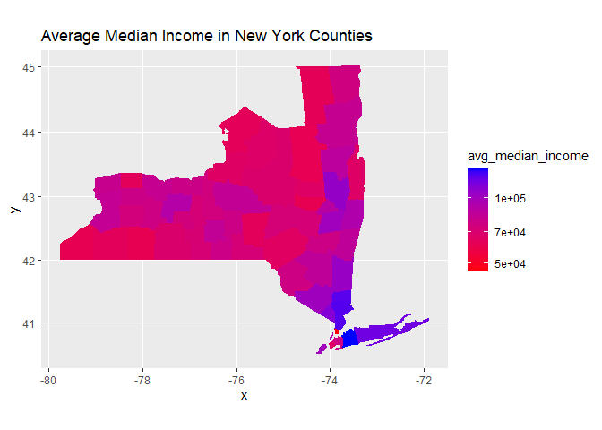

US Income
================
Aaron Huang
2023-04-26

- <a href="#grading-rubric" id="toc-grading-rubric">Grading Rubric</a>
  - <a href="#individual" id="toc-individual">Individual</a>
  - <a href="#submission" id="toc-submission">Submission</a>
- <a href="#setup" id="toc-setup">Setup</a>
  - <a
    href="#q1-load-the-population-data-from-c06-simply-replace-filename_pop-below"
    id="toc-q1-load-the-population-data-from-c06-simply-replace-filename_pop-below"><strong>q1</strong>
    Load the population data from c06; simply replace
    <code>filename_pop</code> below.</a>
  - <a href="#q2-obtain-median-income-data-from-the-census-bureau"
    id="toc-q2-obtain-median-income-data-from-the-census-bureau"><strong>q2</strong>
    Obtain median income data from the Census Bureau:</a>
  - <a
    href="#q3-tidy-the-df_income-dataset-by-completing-the-code-below-pivot-and-rename-the-columns-to-arrive-at-the-column-names-id-geographic_area_name-category-income_estimate-income_moe"
    id="toc-q3-tidy-the-df_income-dataset-by-completing-the-code-below-pivot-and-rename-the-columns-to-arrive-at-the-column-names-id-geographic_area_name-category-income_estimate-income_moe"><strong>q3</strong>
    Tidy the <code>df_income</code> dataset by completing the code below.
    Pivot and rename the columns to arrive at the column names
    <code>id, geographic_area_name, category, income_estimate, income_moe</code>.</a>
  - <a
    href="#q4-convert-the-margin-of-error-to-standard-error-additionally-compute-a-99-confidence-interval-on-income-and-normalize-the-standard-error-to-income_cv--income_se--income_estimate-provide-these-columns-with-the-names-income_se-income_lo-income_hi-income_cv"
    id="toc-q4-convert-the-margin-of-error-to-standard-error-additionally-compute-a-99-confidence-interval-on-income-and-normalize-the-standard-error-to-income_cv--income_se--income_estimate-provide-these-columns-with-the-names-income_se-income_lo-income_hi-income_cv"><strong>q4</strong>
    Convert the margin of error to standard error. Additionally, compute a
    99% confidence interval on income, and normalize the standard error to
    <code>income_CV = income_SE / income_estimate</code>. Provide these
    columns with the names
    <code>income_SE, income_lo, income_hi, income_CV</code>.</a>
  - <a href="#q5-join-df_q4-and-df_pop"
    id="toc-q5-join-df_q4-and-df_pop"><strong>q5</strong> Join
    <code>df_q4</code> and <code>df_pop</code>.</a>
- <a href="#analysis" id="toc-analysis">Analysis</a>
  - <a
    href="#q6-study-the-following-graph-making-sure-to-note-what-you-can-and-cant-conclude-based-on-the-estimates-and-confidence-intervals-document-your-observations-below-and-answer-the-questions"
    id="toc-q6-study-the-following-graph-making-sure-to-note-what-you-can-and-cant-conclude-based-on-the-estimates-and-confidence-intervals-document-your-observations-below-and-answer-the-questions"><strong>q6</strong>
    Study the following graph, making sure to note what you can <em>and
    can’t</em> conclude based on the estimates and confidence intervals.
    Document your observations below and answer the questions.</a>
  - <a
    href="#q7-plot-the-standard-error-against-population-for-all-counties-create-a-visual-that-effectively-highlights-the-trends-in-the-data-answer-the-questions-under-observations-below"
    id="toc-q7-plot-the-standard-error-against-population-for-all-counties-create-a-visual-that-effectively-highlights-the-trends-in-the-data-answer-the-questions-under-observations-below"><strong>q7</strong>
    Plot the standard error against population for all counties. Create a
    visual that effectively highlights the trends in the data. Answer the
    questions under <em>observations</em> below.</a>
- <a href="#going-further" id="toc-going-further">Going Further</a>
  - <a
    href="#q8-pose-your-own-question-about-the-data-create-a-visualization-or-table-here-and-document-your-observations"
    id="toc-q8-pose-your-own-question-about-the-data-create-a-visualization-or-table-here-and-document-your-observations"><strong>q8</strong>
    Pose your own question about the data. Create a visualization (or table)
    here, and document your observations.</a>
- <a href="#references" id="toc-references">References</a>

*Purpose*: We’ve been learning how to quantify uncertainty in estimates
through the exercises; now its time to put those skills to use studying
real data. In this challenge we’ll use concepts like confidence
intervals to help us make sense of census data.

*Reading*: - [Using ACS Estimates and Margin of
Error](https://www.census.gov/data/academy/webinars/2020/calculating-margins-of-error-acs.html)
(Optional, see the PDF on the page) - [Patterns and Causes of
Uncertainty in the American Community
Survey](https://www.sciencedirect.com/science/article/pii/S0143622813002518?casa_token=VddzQ1-spHMAAAAA:FTq92LXgiPVloJUVjnHs8Ma1HwvPigisAYtzfqaGbbRRwoknNq56Y2IzszmGgIGH4JAPzQN0)
(Optional, particularly the *Uncertainty in surveys* section under the
Introduction.)

<!-- include-rubric -->

# Grading Rubric

<!-- -------------------------------------------------- -->

Unlike exercises, **challenges will be graded**. The following rubrics
define how you will be graded, both on an individual and team basis.

## Individual

<!-- ------------------------- -->

| Category    | Needs Improvement                                                                                                | Satisfactory                                                                                                               |
|-------------|------------------------------------------------------------------------------------------------------------------|----------------------------------------------------------------------------------------------------------------------------|
| Effort      | Some task **q**’s left unattempted                                                                               | All task **q**’s attempted                                                                                                 |
| Observed    | Did not document observations, or observations incorrect                                                         | Documented correct observations based on analysis                                                                          |
| Supported   | Some observations not clearly supported by analysis                                                              | All observations clearly supported by analysis (table, graph, etc.)                                                        |
| Assessed    | Observations include claims not supported by the data, or reflect a level of certainty not warranted by the data | Observations are appropriately qualified by the quality & relevance of the data and (in)conclusiveness of the support      |
| Specified   | Uses the phrase “more data are necessary” without clarification                                                  | Any statement that “more data are necessary” specifies which *specific* data are needed to answer what *specific* question |
| Code Styled | Violations of the [style guide](https://style.tidyverse.org/) hinder readability                                 | Code sufficiently close to the [style guide](https://style.tidyverse.org/)                                                 |

## Submission

<!-- ------------------------- -->

Make sure to commit both the challenge report (`report.md` file) and
supporting files (`report_files/` folder) when you are done! Then submit
a link to Canvas. **Your Challenge submission is not complete without
all files uploaded to GitHub.**

# Setup

<!-- ----------------------------------------------------------------------- -->

``` r
library(tidyverse)
```

    ## ── Attaching packages ─────────────────────────────────────── tidyverse 1.3.2 ──
    ## ✔ ggplot2 3.4.0      ✔ purrr   1.0.1 
    ## ✔ tibble  3.1.8      ✔ dplyr   1.0.10
    ## ✔ tidyr   1.2.1      ✔ stringr 1.5.0 
    ## ✔ readr   2.1.3      ✔ forcats 0.5.2 
    ## ── Conflicts ────────────────────────────────────────── tidyverse_conflicts() ──
    ## ✖ dplyr::filter() masks stats::filter()
    ## ✖ dplyr::lag()    masks stats::lag()

``` r
library(ggplot2)
library(maps)
```

    ## 
    ## Attaching package: 'maps'
    ## 
    ## The following object is masked from 'package:purrr':
    ## 
    ##     map

``` r
library(mapdata)
```

    ## Warning: package 'mapdata' was built under R version 4.2.3

``` r
library(mapproj)
library(data.table)
```

    ## Warning: package 'data.table' was built under R version 4.2.3

    ## 
    ## Attaching package: 'data.table'
    ## 
    ## The following objects are masked from 'package:dplyr':
    ## 
    ##     between, first, last
    ## 
    ## The following object is masked from 'package:purrr':
    ## 
    ##     transpose

### **q1** Load the population data from c06; simply replace `filename_pop` below.

``` r
## TODO: Give the filename for your copy of Table B01003
filename_pop <- "data/ACSDT5Y2018.B01003_2023-03-18T224644/ACSDT5Y2018.B01003-Data.csv"

## NOTE: No need to edit
df_pop <-
  read_csv(
    filename_pop,
    skip = 1,
  ) %>% 
  rename(
    population_estimate = `Estimate!!Total`
  )
```

    ## New names:
    ## Rows: 3220 Columns: 7
    ## ── Column specification
    ## ──────────────────────────────────────────────────────── Delimiter: "," chr
    ## (5): Geography, Geographic Area Name, Annotation of Estimate!!Total, Mar... dbl
    ## (1): Estimate!!Total lgl (1): ...7
    ## ℹ Use `spec()` to retrieve the full column specification for this data. ℹ
    ## Specify the column types or set `show_col_types = FALSE` to quiet this message.
    ## • `` -> `...7`

``` r
df_pop
```

    ## # A tibble: 3,220 × 7
    ##    Geography      `Geographic Area Name`   popul…¹ Annot…² Margi…³ Annot…⁴ ...7 
    ##    <chr>          <chr>                      <dbl> <chr>   <chr>   <chr>   <lgl>
    ##  1 0500000US01001 Autauga County, Alabama    55200 null    *****   *****   NA   
    ##  2 0500000US01003 Baldwin County, Alabama   208107 null    *****   *****   NA   
    ##  3 0500000US01005 Barbour County, Alabama    25782 null    *****   *****   NA   
    ##  4 0500000US01007 Bibb County, Alabama       22527 null    *****   *****   NA   
    ##  5 0500000US01009 Blount County, Alabama     57645 null    *****   *****   NA   
    ##  6 0500000US01011 Bullock County, Alabama    10352 null    *****   *****   NA   
    ##  7 0500000US01013 Butler County, Alabama     20025 null    *****   *****   NA   
    ##  8 0500000US01015 Calhoun County, Alabama   115098 null    *****   *****   NA   
    ##  9 0500000US01017 Chambers County, Alabama   33826 null    *****   *****   NA   
    ## 10 0500000US01019 Cherokee County, Alabama   25853 null    *****   *****   NA   
    ## # … with 3,210 more rows, and abbreviated variable names ¹​population_estimate,
    ## #   ²​`Annotation of Estimate!!Total`, ³​`Margin of Error!!Total`,
    ## #   ⁴​`Annotation of Margin of Error!!Total`

You might wonder why the `Margin of Error` in the population estimates
is listed as `*****`. From the [documentation (PDF
link)](https://www.google.com/url?sa=t&rct=j&q=&esrc=s&source=web&cd=&cad=rja&uact=8&ved=2ahUKEwj81Omy16TrAhXsguAKHTzKDQEQFjABegQIBxAB&url=https%3A%2F%2Fwww2.census.gov%2Fprograms-surveys%2Facs%2Ftech_docs%2Faccuracy%2FMultiyearACSAccuracyofData2018.pdf%3F&usg=AOvVaw2TOrVuBDlkDI2gde6ugce_)
for the ACS:

> If the margin of error is displayed as ‘\*\*\*\*\*’ (five asterisks),
> the estimate has been controlled to be equal to a fixed value and so
> it has no sampling error. A standard error of zero should be used for
> these controlled estimates when completing calculations, such as those
> in the following section.

This means that for cases listed as `*****` the US Census Bureau
recommends treating the margin of error (and thus standard error) as
zero.

### **q2** Obtain median income data from the Census Bureau:

- `Filter > Topics > Income and Poverty > Income and Poverty`
- `Filter > Geography > County > All counties in United States`
- Look for `Median Income in the Past 12 Months` (Table S1903)
- Download the 2018 5-year ACS estimates; save to your `data` folder and
  add the filename below.

``` r
## TODO: Give the filename for your copy of Table S1903
filename_income <- "data/ACSST5Y2018.S1903_2023-04-03T163625/ACSST5Y2018.S1903-Data.csv"

## NOTE: No need to edit
df_income <-
  read_csv(filename_income, skip = 1)
```

    ## Warning: One or more parsing issues, call `problems()` on your data frame for details,
    ## e.g.:
    ##   dat <- vroom(...)
    ##   problems(dat)

    ## Rows: 3220 Columns: 482
    ## ── Column specification ────────────────────────────────────────────────────────
    ## Delimiter: ","
    ## chr (306): Geography, Geographic Area Name, Annotation of Margin of Error!!N...
    ## dbl (176): Estimate!!Number!!HOUSEHOLD INCOME BY RACE AND HISPANIC OR LATINO...
    ## 
    ## ℹ Use `spec()` to retrieve the full column specification for this data.
    ## ℹ Specify the column types or set `show_col_types = FALSE` to quiet this message.

``` r
df_income
```

    ## # A tibble: 3,220 × 482
    ##    Geography     Geogr…¹ Estim…² Margi…³ Annot…⁴ Annot…⁵ Estim…⁶ Margi…⁷ Annot…⁸
    ##    <chr>         <chr>     <dbl>   <dbl> <chr>   <chr>     <dbl>   <dbl> <chr>  
    ##  1 0500000US010… Autaug…   21115     383 null    null      16585     363 null   
    ##  2 0500000US010… Baldwi…   78622    1183 null    null      69544    1042 null   
    ##  3 0500000US010… Barbou…    9186     280 null    null       4729     211 null   
    ##  4 0500000US010… Bibb C…    6840     321 null    null       5588     346 null   
    ##  5 0500000US010… Blount…   20600     396 null    null      20054     417 null   
    ##  6 0500000US010… Bulloc…    3609     196 null    null        881     119 null   
    ##  7 0500000US010… Butler…    6708     274 null    null       3821     173 null   
    ##  8 0500000US010… Calhou…   45033     683 null    null      33820     559 null   
    ##  9 0500000US010… Chambe…   13516     372 null    null       7953     296 null   
    ## 10 0500000US010… Cherok…   10606     370 null    null       9953     356 null   
    ## # … with 3,210 more rows, 473 more variables:
    ## #   `Annotation of Estimate!!Number!!HOUSEHOLD INCOME BY RACE AND HISPANIC OR LATINO ORIGIN OF HOUSEHOLDER!!Households!!One race--!!White` <chr>,
    ## #   `Estimate!!Number!!HOUSEHOLD INCOME BY RACE AND HISPANIC OR LATINO ORIGIN OF HOUSEHOLDER!!Households!!One race--!!Black or African American` <dbl>,
    ## #   `Annotation of Estimate!!Number!!HOUSEHOLD INCOME BY RACE AND HISPANIC OR LATINO ORIGIN OF HOUSEHOLDER!!Households!!One race--!!Black or African American` <chr>,
    ## #   `Margin of Error!!Number MOE!!HOUSEHOLD INCOME BY RACE AND HISPANIC OR LATINO ORIGIN OF HOUSEHOLDER!!Households!!One race--!!Black or African American` <dbl>,
    ## #   `Annotation of Margin of Error!!Number MOE!!HOUSEHOLD INCOME BY RACE AND HISPANIC OR LATINO ORIGIN OF HOUSEHOLDER!!Households!!One race--!!Black or African American` <chr>,
    ## #   `Estimate!!Number!!HOUSEHOLD INCOME BY RACE AND HISPANIC OR LATINO ORIGIN OF HOUSEHOLDER!!Households!!One race--!!American Indian and Alaska Native` <dbl>, …

Use the following test to check that you downloaded the correct file:

``` r
## NOTE: No need to edit, use to check you got the right file.
assertthat::assert_that(
  df_income %>%
    filter(Geography == "0500000US01001") %>%
    pull(`Estimate!!Percent Distribution!!FAMILY INCOME BY FAMILY SIZE!!2-person families`)
  == 45.6
)
```

    ## [1] TRUE

``` r
print("Well done!")
```

    ## [1] "Well done!"

This dataset is in desperate need of some *tidying*. To simplify the
task, we’ll start by considering the `\\d-person families` columns
first.

### **q3** Tidy the `df_income` dataset by completing the code below. Pivot and rename the columns to arrive at the column names `id, geographic_area_name, category, income_estimate, income_moe`.

*Hint*: You can do this in a single pivot using the `".value"` argument
and a `names_pattern` using capture groups `"()"`. Remember that you can
use an OR operator `|` in a regex to allow for multiple possibilities in
a capture group, for example `"(Estimate|Margin of Error)"`.

``` r
new_names <- c("id", "geographic_area_name", "category", "income_estimate", "income_moe")

df_q3 <-
  df_income %>%
  select(
    Geography,
    contains("Geographic"),
    # This will select only the numeric d-person family columns;
    # it will ignore the annotation columns
    contains("median") & matches("\\d-person families") & !contains("Annotation of")
  ) %>%
  mutate(across(contains("median"), as.numeric)) %>%
## TODO: Pivot the data, rename the columns
  pivot_longer(cols = -c(Geography, "Geographic Area Name"), 
               names_to = c(".value", "category"), 
               names_pattern = "(Estimate|Margin of Error).*!!FAMILY INCOME BY FAMILY SIZE!!(.*)") %>%
  setnames(old = c('Geographic Area Name','Estimate','Margin of Error'), 
         new = c('geographic_area_name','income_estimate','income_moe'))
```

    ## Warning in mask$eval_all_mutate(quo): NAs introduced by coercion

    ## Warning in mask$eval_all_mutate(quo): NAs introduced by coercion

    ## Warning in mask$eval_all_mutate(quo): NAs introduced by coercion

    ## Warning in mask$eval_all_mutate(quo): NAs introduced by coercion

    ## Warning in mask$eval_all_mutate(quo): NAs introduced by coercion

    ## Warning in mask$eval_all_mutate(quo): NAs introduced by coercion

    ## Warning in mask$eval_all_mutate(quo): NAs introduced by coercion

    ## Warning in mask$eval_all_mutate(quo): NAs introduced by coercion

``` r
df_q3
```

    ## # A tibble: 16,100 × 5
    ##    Geography      geographic_area_name    category          income_est…¹ incom…²
    ##    <chr>          <chr>                   <chr>                    <dbl>   <dbl>
    ##  1 0500000US01001 Autauga County, Alabama 2-person families        64947    6663
    ##  2 0500000US01001 Autauga County, Alabama 3-person families        80172   14181
    ##  3 0500000US01001 Autauga County, Alabama 4-person families        85455   10692
    ##  4 0500000US01001 Autauga County, Alabama 5-person families        88601   20739
    ##  5 0500000US01001 Autauga County, Alabama 6-person families       103787   12387
    ##  6 0500000US01003 Baldwin County, Alabama 2-person families        63975    2297
    ##  7 0500000US01003 Baldwin County, Alabama 3-person families        79390    8851
    ##  8 0500000US01003 Baldwin County, Alabama 4-person families        88458    5199
    ##  9 0500000US01003 Baldwin County, Alabama 5-person families        91259    7011
    ## 10 0500000US01003 Baldwin County, Alabama 6-person families        69609   23175
    ## # … with 16,090 more rows, and abbreviated variable names ¹​income_estimate,
    ## #   ²​income_moe

Use the following tests to check your work:

``` r
## NOTE: No need to edit
assertthat::assert_that(setequal(
  names(df_q3),
  c("Geography", "geographic_area_name", "category", "income_estimate", "income_moe")
))
```

    ## [1] TRUE

``` r
assertthat::assert_that(
  df_q3 %>%
    filter(Geography == "0500000US01001", category == "2-person families") %>%
    pull(income_moe)
  == 6663
)
```

    ## [1] TRUE

``` r
print("Nice!")
```

    ## [1] "Nice!"

The data gives finite values for the Margin of Error, which is closely
related to the Standard Error. The Census Bureau documentation gives the
following relationship between Margin of Error and Standard Error:

$$\text{MOE} = 1.645 \times \text{SE}.$$

### **q4** Convert the margin of error to standard error. Additionally, compute a 99% confidence interval on income, and normalize the standard error to `income_CV = income_SE / income_estimate`. Provide these columns with the names `income_SE, income_lo, income_hi, income_CV`.

``` r
q99 = qnorm( 1 - (1 - 0.99) / 2 )

df_q4 <- df_q3 %>%
  mutate(income_SE = income_moe / 1.645, income_lo = income_estimate - q99 * income_SE, income_hi = income_estimate + q99 * income_SE, income_CV = income_SE / income_estimate)

df_q4
```

    ## # A tibble: 16,100 × 9
    ##    Geography     geogr…¹ categ…² incom…³ incom…⁴ incom…⁵ incom…⁶ incom…⁷ incom…⁸
    ##    <chr>         <chr>   <chr>     <dbl>   <dbl>   <dbl>   <dbl>   <dbl>   <dbl>
    ##  1 0500000US010… Autaug… 2-pers…   64947    6663   4050.  54514.  75380.  0.0624
    ##  2 0500000US010… Autaug… 3-pers…   80172   14181   8621.  57967. 102377.  0.108 
    ##  3 0500000US010… Autaug… 4-pers…   85455   10692   6500.  68713. 102197.  0.0761
    ##  4 0500000US010… Autaug… 5-pers…   88601   20739  12607.  56127. 121075.  0.142 
    ##  5 0500000US010… Autaug… 6-pers…  103787   12387   7530.  84391. 123183.  0.0726
    ##  6 0500000US010… Baldwi… 2-pers…   63975    2297   1396.  60378.  67572.  0.0218
    ##  7 0500000US010… Baldwi… 3-pers…   79390    8851   5381.  65531.  93249.  0.0678
    ##  8 0500000US010… Baldwi… 4-pers…   88458    5199   3160.  80317.  96599.  0.0357
    ##  9 0500000US010… Baldwi… 5-pers…   91259    7011   4262.  80281. 102237.  0.0467
    ## 10 0500000US010… Baldwi… 6-pers…   69609   23175  14088.  33320. 105898.  0.202 
    ## # … with 16,090 more rows, and abbreviated variable names
    ## #   ¹​geographic_area_name, ²​category, ³​income_estimate, ⁴​income_moe,
    ## #   ⁵​income_SE, ⁶​income_lo, ⁷​income_hi, ⁸​income_CV

Use the following tests to check your work:

``` r
## NOTE: No need to edit
assertthat::assert_that(setequal(
  names(df_q4),
  c("Geography", "geographic_area_name", "category", "income_estimate", "income_moe",
    "income_SE", "income_lo", "income_hi", "income_CV")
))
```

    ## [1] TRUE

``` r
assertthat::assert_that(
  abs(
    df_q4 %>%
    filter(Geography == "0500000US01001", category == "2-person families") %>%
    pull(income_SE) - 4050.456
  ) / 4050.456 < 1e-3
)
```

    ## [1] TRUE

``` r
assertthat::assert_that(
  abs(
    df_q4 %>%
    filter(Geography == "0500000US01001", category == "2-person families") %>%
    pull(income_lo) - 54513.72
  ) / 54513.72 < 1e-3
)
```

    ## [1] TRUE

``` r
assertthat::assert_that(
  abs(
    df_q4 %>%
    filter(Geography == "0500000US01001", category == "2-person families") %>%
    pull(income_hi) - 75380.28
  ) / 75380.28 < 1e-3
)
```

    ## [1] TRUE

``` r
assertthat::assert_that(
  abs(
    df_q4 %>%
    filter(Geography == "0500000US01001", category == "2-person families") %>%
    pull(income_CV) - 0.06236556
  ) / 0.06236556 < 1e-3
)
```

    ## [1] TRUE

``` r
print("Nice!")
```

    ## [1] "Nice!"

One last wrangling step: We need to join the two datasets so we can
compare population with income.

### **q5** Join `df_q4` and `df_pop`.

``` r
## TODO: Join df_q4 and df_pop by the appropriate column
df_data = left_join(df_q4, df_pop, by = "Geography")
df_data
```

    ## # A tibble: 16,100 × 15
    ##    Geography     geogr…¹ categ…² incom…³ incom…⁴ incom…⁵ incom…⁶ incom…⁷ incom…⁸
    ##    <chr>         <chr>   <chr>     <dbl>   <dbl>   <dbl>   <dbl>   <dbl>   <dbl>
    ##  1 0500000US010… Autaug… 2-pers…   64947    6663   4050.  54514.  75380.  0.0624
    ##  2 0500000US010… Autaug… 3-pers…   80172   14181   8621.  57967. 102377.  0.108 
    ##  3 0500000US010… Autaug… 4-pers…   85455   10692   6500.  68713. 102197.  0.0761
    ##  4 0500000US010… Autaug… 5-pers…   88601   20739  12607.  56127. 121075.  0.142 
    ##  5 0500000US010… Autaug… 6-pers…  103787   12387   7530.  84391. 123183.  0.0726
    ##  6 0500000US010… Baldwi… 2-pers…   63975    2297   1396.  60378.  67572.  0.0218
    ##  7 0500000US010… Baldwi… 3-pers…   79390    8851   5381.  65531.  93249.  0.0678
    ##  8 0500000US010… Baldwi… 4-pers…   88458    5199   3160.  80317.  96599.  0.0357
    ##  9 0500000US010… Baldwi… 5-pers…   91259    7011   4262.  80281. 102237.  0.0467
    ## 10 0500000US010… Baldwi… 6-pers…   69609   23175  14088.  33320. 105898.  0.202 
    ## # … with 16,090 more rows, 6 more variables: `Geographic Area Name` <chr>,
    ## #   population_estimate <dbl>, `Annotation of Estimate!!Total` <chr>,
    ## #   `Margin of Error!!Total` <chr>,
    ## #   `Annotation of Margin of Error!!Total` <chr>, ...7 <lgl>, and abbreviated
    ## #   variable names ¹​geographic_area_name, ²​category, ³​income_estimate,
    ## #   ⁴​income_moe, ⁵​income_SE, ⁶​income_lo, ⁷​income_hi, ⁸​income_CV

# Analysis

<!-- ----------------------------------------------------------------------- -->

We now have both estimates and confidence intervals for
`\\d-person families`. Now we can compare cases with quantified
uncertainties: Let’s practice!

### **q6** Study the following graph, making sure to note what you can *and can’t* conclude based on the estimates and confidence intervals. Document your observations below and answer the questions.

``` r
## NOTE: No need to edit; run and inspect
wid <- 0.5

df_data %>%
  filter(str_detect(geographic_area_name, "Massachusetts")) %>%
  mutate(
    county = str_remove(geographic_area_name, " County,.*$"),
    county = fct_reorder(county, income_estimate)
  ) %>%

  ggplot(aes(county, income_estimate, color = category)) +
  geom_errorbar(
    aes(ymin = income_lo, ymax = income_hi),
    position = position_dodge(width = wid)
  ) +
  geom_point(position = position_dodge(width = wid)) +

  coord_flip() +
  labs(
    x = "County",
    y = "Median Household Income"
  )
```

    ## Warning: Removed 2 rows containing missing values (`geom_point()`).

<!-- -->

**Observations**:

- Document your observations here.
  - Median income values for 6-person families tend to have the widest
    confidence intervals.
  - Nantucket and Dukes county have wide confidence intervals for all
    family sizes.
  - 3 and above family sizes tend to be close together while 2 person
    families tend to be lower.
- Can you confidently distinguish between household incomes in Suffolk
  county? Why or why not?
  - No you can not confidently distinguish between household incomes in
    Suffolk county due to their close median income estimates and
    overlapping confidence intervals.
- Which counties have the widest confidence intervals?
  - Nantucket, Dukes, Hampshire, Berksire, and Franklin have the widest
    confidence intervals.

In the next task you’ll investigate the relationship between population
and uncertainty.

### **q7** Plot the standard error against population for all counties. Create a visual that effectively highlights the trends in the data. Answer the questions under *observations* below.

*Hint*: Remember that standard error is a function of *both* variability
(e.g. variance) and sample size.

``` r
df_data %>%
  filter(str_detect(geographic_area_name, "Massachusetts")) %>%
  mutate(
    county = str_remove(geographic_area_name, " County,.*$"),
    county = fct_reorder(county, income_estimate)
  ) %>%
  ggplot(aes(x = population_estimate, y = income_SE, color = county)) +
  geom_point() +
  labs(
    x = "Population",
    y = "SE"
  )
```

    ## Warning: Removed 2 rows containing missing values (`geom_point()`).

<!-- -->

**Observations**:

- What *overall* trend do you see between `SE` and population? Why might
  this trend exist?
  - It appears that the SE decreases as you increase the population.
    Although it seems like SE decreases with higher population, it is
    important to note that the standard error depends on the sample size
    and not the population size. A population size does not directly
    correlate to a larger sample size, but if the census buareau
    collects a percentage of the population, then a larger population
    would mean a larger sample size and thus a lower standard error.
- What does this *overall* trend tell you about the relative ease of
  studying small vs large counties?
  - When studying a large county, you do not need to be as concerned
    about uncertainties and confidence intervals, however, as the
    population decreases, the available data also decreases, which makes
    it harder to study.

# Going Further

<!-- ----------------------------------------------------------------------- -->

Now it’s your turn! You have income data for every county in the United
States: Pose your own question and try to answer it with the data.

### **q8** Pose your own question about the data. Create a visualization (or table) here, and document your observations.

``` r
df_ny <- df_data %>%
  filter(str_detect(geographic_area_name, "New York")) %>%
  mutate(
  subregion = tolower(str_remove(geographic_area_name, " County,.*$"))) %>%
  group_by(subregion) %>%
  summarize(subregion, avg_median_income = mean(income_estimate, na.rm = TRUE)) %>%
  distinct()
```

    ## `summarise()` has grouped output by 'subregion'. You can override using the
    ## `.groups` argument.

``` r
ny_map <- map_data("county", region = "new york") %>%
  select(-c(region)) %>%
  setnames(old = c('subregion'), 
         new = c('region'))

ggplot(df_ny) +
  geom_map(aes(map_id = subregion, fill = avg_median_income), map = ny_map) +
  expand_limits(x = ny_map$long, y = ny_map$lat) +
  coord_map() +
  scale_fill_gradient(trans = "log10", low = "red", high = "blue") +
  ggtitle("Average Median Income in New York Counties")
```

<!-- -->

**Observations**:

-Background: New York has the highest economic inequality in the United
States. It would be interesting to explore which counties are the
richest and poorest - Q: Where are the rich and poor counties in New
York State?

- Observations:
- The southern part of New York has the highest median income on
  average. This does make since considering long island is a global hub
  for trade.
- The median income ranges from \$50,000 on the low end and up to
  \$100,000 on the high end.
- Interestingly, the Bronx has a significantly lower median income than
  its surrounding counties.
- The high income counties tend to cluster together and vice versa, the
  low income counties tend to cluster together.

Ideas:

- Compare trends across counties that are relevant to you; e.g. places
  you’ve lived, places you’ve been, places in the US that are
  interesting to you.
- In q3 we tidied the median `\\d-person families` columns only.
  - Tidy the other median columns to learn about other people groups.
  - Tidy the percentage columns to learn about how many households of
    each category are in each county.
- Your own idea!

# References

<!-- ----------------------------------------------------------------------- -->

\[1\] Spielman SE, Folch DC, Nagle NN (2014) Patterns and causes of
uncertainty in the American Community Survey. Applied Geography 46:
147–157. <pmid:25404783>
[link](https://www.sciencedirect.com/science/article/pii/S0143622813002518?casa_token=VddzQ1-spHMAAAAA:FTq92LXgiPVloJUVjnHs8Ma1HwvPigisAYtzfqaGbbRRwoknNqZ6Y2IzszmGgIGH4JAPzQN0)
