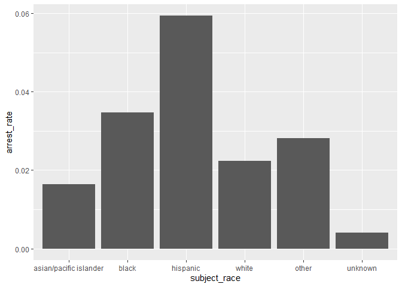

Massachusetts Highway Stops
================
Aaron Huang
2023-5-5

- <a href="#grading-rubric" id="toc-grading-rubric">Grading Rubric</a>
  - <a href="#individual" id="toc-individual">Individual</a>
  - <a href="#due-date" id="toc-due-date">Due Date</a>
- <a href="#setup" id="toc-setup">Setup</a>
  - <a
    href="#q1-go-to-the-stanford-open-policing-project-page-and-download-the-massachusetts-state-police-records-in-rds-format-move-the-data-to-your-data-folder-and-match-the-filename-to-load-the-data"
    id="toc-q1-go-to-the-stanford-open-policing-project-page-and-download-the-massachusetts-state-police-records-in-rds-format-move-the-data-to-your-data-folder-and-match-the-filename-to-load-the-data"><strong>q1</strong>
    Go to the Stanford Open Policing Project page and download the
    Massachusetts State Police records in <code>Rds</code> format. Move the
    data to your <code>data</code> folder and match the
    <code>filename</code> to load the data.</a>
- <a href="#eda" id="toc-eda">EDA</a>
  - <a
    href="#q2-do-your-first-checks-on-the-dataset-what-are-the-basic-facts-about-this-dataset"
    id="toc-q2-do-your-first-checks-on-the-dataset-what-are-the-basic-facts-about-this-dataset"><strong>q2</strong>
    Do your “first checks” on the dataset. What are the basic facts about
    this dataset?</a>
  - <a
    href="#q3-check-the-set-of-factor-levels-for-subject_race-and-raw_race-what-do-you-note-about-overlap--difference-between-the-two-sets"
    id="toc-q3-check-the-set-of-factor-levels-for-subject_race-and-raw_race-what-do-you-note-about-overlap--difference-between-the-two-sets"><strong>q3</strong>
    Check the set of factor levels for <code>subject_race</code> and
    <code>raw_Race</code>. What do you note about overlap / difference
    between the two sets?</a>
  - <a
    href="#q4-check-whether-subject_race-and-raw_race-match-for-a-large-fraction-of-cases-which-of-the-two-hypotheses-above-is-most-likely-based-on-your-results"
    id="toc-q4-check-whether-subject_race-and-raw_race-match-for-a-large-fraction-of-cases-which-of-the-two-hypotheses-above-is-most-likely-based-on-your-results"><strong>q4</strong>
    Check whether <code>subject_race</code> and <code>raw_Race</code> match
    for a large fraction of cases. Which of the two hypotheses above is most
    likely, based on your results?</a>
  - <a href="#vis" id="toc-vis">Vis</a>
    - <a
      href="#q5-compare-the-arrest-ratethe-fraction-of-total-cases-in-which-the-subject-was-arrestedacross-different-factors-create-as-many-visuals-or-tables-as-you-need-but-make-sure-to-check-the-trends-across-all-of-the-subject-variables-answer-the-questions-under-observations-below"
      id="toc-q5-compare-the-arrest-ratethe-fraction-of-total-cases-in-which-the-subject-was-arrestedacross-different-factors-create-as-many-visuals-or-tables-as-you-need-but-make-sure-to-check-the-trends-across-all-of-the-subject-variables-answer-the-questions-under-observations-below"><strong>q5</strong>
      Compare the <em>arrest rate</em>—the fraction of total cases in which
      the subject was arrested—across different factors. Create as many
      visuals (or tables) as you need, but make sure to check the trends
      across all of the <code>subject</code> variables. Answer the questions
      under <em>observations</em> below.</a>
- <a href="#modeling" id="toc-modeling">Modeling</a>
  - <a
    href="#q6-run-the-following-code-and-interpret-the-regression-coefficients-answer-the-the-questions-under-observations-below"
    id="toc-q6-run-the-following-code-and-interpret-the-regression-coefficients-answer-the-the-questions-under-observations-below"><strong>q6</strong>
    Run the following code and interpret the regression coefficients. Answer
    the the questions under <em>observations</em> below.</a>
  - <a
    href="#q7-re-fit-the-logistic-regression-from-q6-setting-white-as-the-reference-level-for-subject_race-interpret-the-the-model-terms-and-answer-the-questions-below"
    id="toc-q7-re-fit-the-logistic-regression-from-q6-setting-white-as-the-reference-level-for-subject_race-interpret-the-the-model-terms-and-answer-the-questions-below"><strong>q7</strong>
    Re-fit the logistic regression from q6 setting <code>"white"</code> as
    the reference level for <code>subject_race</code>. Interpret the the
    model terms and answer the questions below.</a>
  - <a
    href="#q8-re-fit-the-model-using-a-factor-indicating-the-presence-of-contraband-in-the-subjects-vehicle-answer-the-questions-under-observations-below"
    id="toc-q8-re-fit-the-model-using-a-factor-indicating-the-presence-of-contraband-in-the-subjects-vehicle-answer-the-questions-under-observations-below"><strong>q8</strong>
    Re-fit the model using a factor indicating the presence of contraband in
    the subject’s vehicle. Answer the questions under <em>observations</em>
    below.</a>
  - <a
    href="#q9-go-deeper-pose-at-least-one-more-question-about-the-data-and-fit-at-least-one-more-model-in-support-of-answering-that-question"
    id="toc-q9-go-deeper-pose-at-least-one-more-question-about-the-data-and-fit-at-least-one-more-model-in-support-of-answering-that-question"><strong>q9</strong>
    Go deeper: Pose at least one more question about the data and fit at
    least one more model in support of answering that question.</a>
  - <a href="#further-reading" id="toc-further-reading">Further Reading</a>

*Purpose*: In this last challenge we’ll focus on using logistic
regression to study a large, complicated dataset. Interpreting the
results of a model can be challenging—both in terms of the statistics
and the real-world reasoning—so we’ll get some practice in this
challenge.

<!-- include-rubric -->

# Grading Rubric

<!-- -------------------------------------------------- -->

Unlike exercises, **challenges will be graded**. The following rubrics
define how you will be graded, both on an individual and team basis.

## Individual

<!-- ------------------------- -->

| Category    | Needs Improvement                                                                                                | Satisfactory                                                                                                               |
|-------------|------------------------------------------------------------------------------------------------------------------|----------------------------------------------------------------------------------------------------------------------------|
| Effort      | Some task **q**’s left unattempted                                                                               | All task **q**’s attempted                                                                                                 |
| Observed    | Did not document observations, or observations incorrect                                                         | Documented correct observations based on analysis                                                                          |
| Supported   | Some observations not clearly supported by analysis                                                              | All observations clearly supported by analysis (table, graph, etc.)                                                        |
| Assessed    | Observations include claims not supported by the data, or reflect a level of certainty not warranted by the data | Observations are appropriately qualified by the quality & relevance of the data and (in)conclusiveness of the support      |
| Specified   | Uses the phrase “more data are necessary” without clarification                                                  | Any statement that “more data are necessary” specifies which *specific* data are needed to answer what *specific* question |
| Code Styled | Violations of the [style guide](https://style.tidyverse.org/) hinder readability                                 | Code sufficiently close to the [style guide](https://style.tidyverse.org/)                                                 |

## Due Date

<!-- ------------------------- -->

All the deliverables stated in the rubrics above are due **at midnight**
before the day of the class discussion of the challenge. See the
[Syllabus](https://docs.google.com/document/d/1qeP6DUS8Djq_A0HMllMqsSqX3a9dbcx1/edit?usp=sharing&ouid=110386251748498665069&rtpof=true&sd=true)
for more information.

*Background*: We’ll study data from the [Stanford Open Policing
Project](https://openpolicing.stanford.edu/data/), specifically their
dataset on Massachusetts State Patrol police stops.

``` r
library(tidyverse)
```

    ## ── Attaching packages ─────────────────────────────────────── tidyverse 1.3.2 ──
    ## ✔ ggplot2 3.4.0      ✔ purrr   1.0.1 
    ## ✔ tibble  3.1.8      ✔ dplyr   1.0.10
    ## ✔ tidyr   1.2.1      ✔ stringr 1.5.0 
    ## ✔ readr   2.1.3      ✔ forcats 0.5.2 
    ## ── Conflicts ────────────────────────────────────────── tidyverse_conflicts() ──
    ## ✖ dplyr::filter() masks stats::filter()
    ## ✖ dplyr::lag()    masks stats::lag()

``` r
library(broom)
```

# Setup

<!-- -------------------------------------------------- -->

### **q1** Go to the [Stanford Open Policing Project](https://openpolicing.stanford.edu/data/) page and download the Massachusetts State Police records in `Rds` format. Move the data to your `data` folder and match the `filename` to load the data.

*Note*: An `Rds` file is an R-specific file format. The function
`readRDS` will read these files.

``` r
## TODO: Download the data, move to your data folder, and load it
filename <- "data/ma_statewide_2020_04_01.rds"
df_data <- readRDS(filename)
```

# EDA

<!-- -------------------------------------------------- -->

### **q2** Do your “first checks” on the dataset. What are the basic facts about this dataset?

``` r
## TODO: Determine the factor levels for subject_race and raw_Race
glimpse(df_data)
```

    ## Rows: 3,416,238
    ## Columns: 24
    ## $ raw_row_number             <chr> "1", "2", "3", "4", "5", "6", "7", "8", "9"…
    ## $ date                       <date> 2007-06-06, 2007-06-07, 2007-06-07, 2007-0…
    ## $ location                   <chr> "MIDDLEBOROUGH", "SEEKONK", "MEDFORD", "MED…
    ## $ county_name                <chr> "Plymouth County", "Bristol County", "Middl…
    ## $ subject_age                <int> 33, 36, 56, 37, 22, 34, 54, 31, 21, 56, 56,…
    ## $ subject_race               <fct> white, white, white, white, hispanic, white…
    ## $ subject_sex                <fct> male, male, female, male, female, male, mal…
    ## $ type                       <fct> vehicular, vehicular, vehicular, vehicular,…
    ## $ arrest_made                <lgl> FALSE, FALSE, FALSE, FALSE, FALSE, FALSE, F…
    ## $ citation_issued            <lgl> TRUE, FALSE, FALSE, FALSE, TRUE, TRUE, TRUE…
    ## $ warning_issued             <lgl> FALSE, TRUE, TRUE, TRUE, FALSE, FALSE, FALS…
    ## $ outcome                    <fct> citation, warning, warning, warning, citati…
    ## $ contraband_found           <lgl> NA, FALSE, NA, NA, NA, NA, NA, NA, NA, NA, …
    ## $ contraband_drugs           <lgl> NA, FALSE, NA, NA, NA, NA, NA, NA, NA, NA, …
    ## $ contraband_weapons         <lgl> NA, FALSE, NA, NA, NA, NA, NA, NA, NA, NA, …
    ## $ contraband_alcohol         <lgl> FALSE, FALSE, FALSE, FALSE, FALSE, FALSE, F…
    ## $ contraband_other           <lgl> NA, FALSE, NA, NA, NA, NA, NA, NA, NA, NA, …
    ## $ frisk_performed            <lgl> NA, FALSE, NA, NA, NA, NA, NA, NA, NA, NA, …
    ## $ search_conducted           <lgl> FALSE, TRUE, FALSE, FALSE, FALSE, FALSE, FA…
    ## $ search_basis               <fct> NA, other, NA, NA, NA, NA, NA, NA, NA, NA, …
    ## $ reason_for_stop            <chr> "Speed", NA, NA, NA, NA, "Speed", NA, NA, N…
    ## $ vehicle_type               <chr> "Passenger", "Commercial", "Passenger", "Co…
    ## $ vehicle_registration_state <fct> MA, MA, MA, MA, MA, MA, MA, MA, MA, MA, MA,…
    ## $ raw_Race                   <chr> "White", "White", "White", "White", "Hispan…

``` r
head(df_data)
```

    ## # A tibble: 6 × 24
    ##   raw_row_num…¹ date       locat…² count…³ subje…⁴ subje…⁵ subje…⁶ type  arres…⁷
    ##   <chr>         <date>     <chr>   <chr>     <int> <fct>   <fct>   <fct> <lgl>  
    ## 1 1             2007-06-06 MIDDLE… Plymou…      33 white   male    vehi… FALSE  
    ## 2 2             2007-06-07 SEEKONK Bristo…      36 white   male    vehi… FALSE  
    ## 3 3             2007-06-07 MEDFORD Middle…      56 white   female  vehi… FALSE  
    ## 4 4             2007-06-07 MEDFORD Middle…      37 white   male    vehi… FALSE  
    ## 5 5             2007-06-07 EVERETT Middle…      22 hispan… female  vehi… FALSE  
    ## 6 6             2007-06-07 MEDFORD Middle…      34 white   male    vehi… FALSE  
    ## # … with 15 more variables: citation_issued <lgl>, warning_issued <lgl>,
    ## #   outcome <fct>, contraband_found <lgl>, contraband_drugs <lgl>,
    ## #   contraband_weapons <lgl>, contraband_alcohol <lgl>, contraband_other <lgl>,
    ## #   frisk_performed <lgl>, search_conducted <lgl>, search_basis <fct>,
    ## #   reason_for_stop <chr>, vehicle_type <chr>,
    ## #   vehicle_registration_state <fct>, raw_Race <chr>, and abbreviated variable
    ## #   names ¹​raw_row_number, ²​location, ³​county_name, ⁴​subject_age, …

``` r
summary(df_data)
```

    ##  raw_row_number          date              location         county_name       
    ##  Length:3416238     Min.   :2007-01-01   Length:3416238     Length:3416238    
    ##  Class :character   1st Qu.:2009-04-22   Class :character   Class :character  
    ##  Mode  :character   Median :2011-07-08   Mode  :character   Mode  :character  
    ##                     Mean   :2011-07-16                                        
    ##                     3rd Qu.:2013-08-27                                        
    ##                     Max.   :2015-12-31                                        
    ##                                                                               
    ##   subject_age                     subject_race     subject_sex     
    ##  Min.   :10.00    asian/pacific islander: 166842   male  :2362238  
    ##  1st Qu.:25.00    black                 : 351610   female:1038377  
    ##  Median :34.00    hispanic              : 338317   NA's  :  15623  
    ##  Mean   :36.47    white                 :2529780                   
    ##  3rd Qu.:46.00    other                 :  11008                   
    ##  Max.   :94.00    unknown               :  17017                   
    ##  NA's   :158006   NA's                  :   1664                   
    ##          type         arrest_made     citation_issued warning_issued 
    ##  pedestrian:      0   Mode :logical   Mode :logical   Mode :logical  
    ##  vehicular :3416238   FALSE:3323303   FALSE:1244039   FALSE:2269244  
    ##                       TRUE :92019     TRUE :2171283   TRUE :1146078  
    ##                       NA's :916       NA's :916       NA's :916      
    ##                                                                      
    ##                                                                      
    ##                                                                      
    ##      outcome        contraband_found contraband_drugs contraband_weapons
    ##  warning :1146078   Mode :logical    Mode :logical    Mode :logical     
    ##  citation:2171283   FALSE:28256      FALSE:36296      FALSE:53237       
    ##  summons :      0   TRUE :27474      TRUE :19434      TRUE :2493        
    ##  arrest  :  92019   NA's :3360508    NA's :3360508    NA's :3360508     
    ##  NA's    :   6858                                                       
    ##                                                                         
    ##                                                                         
    ##  contraband_alcohol contraband_other frisk_performed search_conducted
    ##  Mode :logical      Mode :logical    Mode :logical   Mode :logical   
    ##  FALSE:3400070      FALSE:51708      FALSE:51029     FALSE:3360508   
    ##  TRUE :16168        TRUE :4022       TRUE :3602      TRUE :55730     
    ##                     NA's :3360508    NA's :3361607                   
    ##                                                                      
    ##                                                                      
    ##                                                                      
    ##          search_basis     reason_for_stop    vehicle_type      
    ##  k9            :      0   Length:3416238     Length:3416238    
    ##  plain view    :      0   Class :character   Class :character  
    ##  consent       :   6903   Mode  :character   Mode  :character  
    ##  probable cause:  25898                                        
    ##  other         :  18228                                        
    ##  NA's          :3365209                                        
    ##                                                                
    ##  vehicle_registration_state   raw_Race        
    ##  MA     :3053713            Length:3416238    
    ##  CT     :  82906            Class :character  
    ##  NY     :  69059            Mode  :character  
    ##  NH     :  51514                              
    ##  RI     :  39375                              
    ##  (Other): 109857                              
    ##  NA's   :   9814

There are a total of 24 columns and 3.4+ rows of data. The columns are
row_row_number, date, location, county_name, subject_age, subject_race,
subject_sex, type, arrest_made, citation_issued, warning_issued,
outcome, contraband_found, contraband_drugs, contraband_weapons,
contraband_alcohol, contraband_other, frisk_performed, search_conducted,
search_basis, reason_for_stop, vehicle_type, vehicle_registration_state,
and raw_race. There seems to be lots of NA for certain columns such as
column names with contraband.

Note that we have both a `subject_race` and `race_Raw` column. There are
a few possibilities as to what `race_Raw` represents:

- `race_Raw` could be the race of the police officer in the stop
- `race_Raw` could be an unprocessed version of `subject_race`

Let’s try to distinguish between these two possibilities.

### **q3** Check the set of factor levels for `subject_race` and `raw_Race`. What do you note about overlap / difference between the two sets?

``` r
## TODO: Determine the factor levels for subject_race and raw_Race
df_data %>%
  select(subject_race) %>%
  unique()
```

    ## # A tibble: 7 × 1
    ##   subject_race          
    ##   <fct>                 
    ## 1 white                 
    ## 2 hispanic              
    ## 3 black                 
    ## 4 asian/pacific islander
    ## 5 other                 
    ## 6 <NA>                  
    ## 7 unknown

``` r
df_data %>%
  select(raw_Race) %>%
  unique()
```

    ## # A tibble: 9 × 1
    ##   raw_Race                                     
    ##   <chr>                                        
    ## 1 White                                        
    ## 2 Hispanic                                     
    ## 3 Black                                        
    ## 4 Asian or Pacific Islander                    
    ## 5 Middle Eastern or East Indian (South Asian)  
    ## 6 American Indian or Alaskan Native            
    ## 7 <NA>                                         
    ## 8 None - for no operator present citations only
    ## 9 A

**Observations**:

- What are the unique values for `subject_race`? The unique values for
  subject_race are white, hispanic, black, asian/pacific islander,
  other, NA, and unknown
- What are the unique values for `raw_Race`? The unique values for
  raw_Race are white, hispanic, black, asian or pacific islander, middle
  eastern or east indian, american indian or alaskan native, NA, none,
  and A
- What is the overlap between the two sets? The overlap between the two
  are white, hispanic, black, asian/pacific islander, and NA.
- What is the difference between the two sets? The unique values only
  found in subject_race are other and unknown. The unique values only
  found in raw_Race are middle eastern or east indian, american Indian
  or Alaskan native, none, and A.

### **q4** Check whether `subject_race` and `raw_Race` match for a large fraction of cases. Which of the two hypotheses above is most likely, based on your results?

*Note*: Just to be clear, I’m *not* asking you to do a *statistical*
hypothesis test.

``` r
## TODO: Devise your own way to test the hypothesis posed above.
df_data %>%
  select(subject_race, raw_Race) %>%
  filter(raw_Race == "A")
```

    ## # A tibble: 2 × 2
    ##   subject_race raw_Race
    ##   <fct>        <chr>   
    ## 1 other        A       
    ## 2 other        A

``` r
df_data %>%
  select(subject_race, raw_Race) %>%
  filter(raw_Race == "None - for no operator present citations only")
```

    ## # A tibble: 17,017 × 2
    ##    subject_race raw_Race                                     
    ##    <fct>        <chr>                                        
    ##  1 unknown      None - for no operator present citations only
    ##  2 unknown      None - for no operator present citations only
    ##  3 unknown      None - for no operator present citations only
    ##  4 unknown      None - for no operator present citations only
    ##  5 unknown      None - for no operator present citations only
    ##  6 unknown      None - for no operator present citations only
    ##  7 unknown      None - for no operator present citations only
    ##  8 unknown      None - for no operator present citations only
    ##  9 unknown      None - for no operator present citations only
    ## 10 unknown      None - for no operator present citations only
    ## # … with 17,007 more rows

**Observations**

Between the two hypotheses:

- `race_Raw` could be the race of the police officer in the stop
- `race_Raw` could be an unprocessed version of `subject_race`

which is most plausible, based on your results?

- race_Raw could be an unprocessed version of subject_race because
  comparing the two columns, most of the values are the same except for
  capital letters in raw_Race and lowercase letters in subject_race.
  Middle Eastern or East Indian is converted to asian/pacific islander,
  American Indian or Alaskan Native and A are converted to other, and
  none is converted to unknown. These conversions are equivalent in
  value which suggests race_Raw is the unprocessed version.

## Vis

<!-- ------------------------- -->

### **q5** Compare the *arrest rate*—the fraction of total cases in which the subject was arrested—across different factors. Create as many visuals (or tables) as you need, but make sure to check the trends across all of the `subject` variables. Answer the questions under *observations* below.

(Note: Create as many chunks and visuals as you need)

``` r
# Calculate arrest rate by age
df_data_clean <- df_data[complete.cases(df_data$subject_age, df_data$arrest_made), ]
df_data_clean <- df_data_clean %>%
  mutate(age_group = cut(subject_age, breaks = c(0, 25, 30, 35, 40, 45, 50,Inf), 
                         labels = c("18-25", "26-30", "31-35", "36-40", "41-45", "46-50", "51+"), right = FALSE))


arrest_rate_by_age <- df_data_clean %>%
  group_by(age_group) %>%
  summarize(arrest_rate = mean(arrest_made))

arrest_rate_by_age %>%
  ggplot(aes(age_group, arrest_rate)) +
  geom_col()
```

<!-- -->

``` r
# Calculate arrest rate by sex
df_data_clean <- df_data[complete.cases(df_data$subject_sex, df_data$arrest_made), ]

arrest_rate_by_sex <- df_data_clean %>%
  group_by(subject_sex) %>%
  summarize(arrest_rate = mean(arrest_made))

arrest_rate_by_sex %>%
  ggplot(aes(subject_sex, arrest_rate)) +
  geom_col()
```

<!-- -->

``` r
# Calculate arrest rate by race
df_data_clean <- df_data[complete.cases(df_data$subject_race, df_data$arrest_made), ]

arrest_rate_by_race <- df_data_clean %>%
  group_by(subject_race) %>%
  summarize(arrest_rate = mean(arrest_made))

arrest_rate_by_race %>%
  ggplot(aes(subject_race, arrest_rate)) +
  geom_col()
```

<!-- -->
**Observations**:

- How does `arrest_rate` tend to vary with `subject_age`?
  - People in the age range group from 26 to 35 tend to have higher
    arrest rates compared to other age groups. Arrest rates jump from
    the 18-25 age group to the next age group. Arrest rates for age
    groups after 31-35 decreases as age increases.
- How does `arrest_rate` tend to vary with `subject_sex`?
  - The arrest rate for male subjects are more than double than that of
    female subjects.
- How does `arrest_rate` tend to vary with `subject_race`?
  - Arrest rates for Hispanics are higher than any other race group,
    followed by black people. Arrest rates for asian, white, and other
    are pretty similar.

# Modeling

<!-- -------------------------------------------------- -->

We’re going to use a model to study the relationship between `subject`
factors and arrest rate, but first we need to understand a bit more
about *dummy variables*

### **q6** Run the following code and interpret the regression coefficients. Answer the the questions under *observations* below.

``` r
## NOTE: No need to edit; inspect the estimated model terms.
fit_q6 <-
  glm(
    formula = arrest_made ~ subject_age + subject_race + subject_sex,
    data = df_data %>%
      filter(
        !is.na(arrest_made),
        subject_race %in% c("white", "black", "hispanic")
      ),
    family = "binomial"
  )

fit_q6 %>% tidy()
```

    ## # A tibble: 5 × 5
    ##   term                 estimate std.error statistic   p.value
    ##   <chr>                   <dbl>     <dbl>     <dbl>     <dbl>
    ## 1 (Intercept)           -2.67    0.0132      -202.  0        
    ## 2 subject_age           -0.0142  0.000280     -50.5 0        
    ## 3 subject_racehispanic   0.513   0.0119        43.3 0        
    ## 4 subject_racewhite     -0.380   0.0103       -37.0 3.12e-299
    ## 5 subject_sexfemale     -0.755   0.00910      -83.0 0

**Observations**:

- Which `subject_race` levels are included in fitting the model?
  - Hispanic, white, and black are included in the fitting the model.
- Which `subject_race` levels have terms in the model?
  - The estimated coefficients for Hispanic and white are 0.513 and
    -0.380, which suggests individuals who are classified as Hispanic
    are more likely to get arrested and individuals are are classified
    as white are associated with lower arrest rates.

You should find that each factor in the model has a level *missing* in
its set of terms. This is because R represents factors against a
*reference level*: The model treats one factor level as “default”, and
each factor model term represents a change from that “default” behavior.
For instance, the model above treats `subject_sex==male` as the
reference level, so the `subject_sexfemale` term represents the *change
in probability* of arrest due to a person being female (rather than
male).

The this reference level approach to coding factors is necessary for
[technical
reasons](https://www.andrew.cmu.edu/user/achoulde/94842/lectures/lecture10/lecture10-94842.html#why-is-one-of-the-levels-missing-in-the-regression),
but it complicates interpreting the model results. For instance; if we
want to compare two levels, neither of which are the reference level, we
have to consider the difference in their model coefficients. But if we
want to compare all levels against one “baseline” level, then we can
relevel the data to facilitate this comparison.

By default `glm` uses the first factor level present as the reference
level. Therefore we can use
`mutate(factor = fct_relevel(factor, "desired_level"))` to set our
`"desired_level"` as the reference factor.

### **q7** Re-fit the logistic regression from q6 setting `"white"` as the reference level for `subject_race`. Interpret the the model terms and answer the questions below.

``` r
## TODO: Re-fit the logistic regression, but set "white" as the reference
## level for subject_race
# Refit the model with "white" as the reference level for subject_race

fit_q7_refit <- glm(
  formula = arrest_made ~ subject_age + subject_race + subject_sex,
  data = df_data %>%
      filter(
        !is.na(arrest_made),
        subject_race %in% c("white", "black", "hispanic", "asian/pacific islander")
      ) %>% 
      mutate(subject_race = fct_relevel(subject_race, "white")),
  family = "binomial"
)

# Print out the updated model coefficients
fit_q7_refit %>% tidy()
```

    ## # A tibble: 6 × 5
    ##   term                               estimate std.error statistic   p.value
    ##   <chr>                                 <dbl>     <dbl>     <dbl>     <dbl>
    ## 1 (Intercept)                         -3.04    0.0108      -282.  0        
    ## 2 subject_age                         -0.0144  0.000277     -51.9 0        
    ## 3 subject_raceasian/pacific islander  -0.389   0.0200       -19.4 7.03e- 84
    ## 4 subject_raceblack                    0.379   0.0103        36.9 9.97e-299
    ## 5 subject_racehispanic                 0.892   0.00859      104.  0        
    ## 6 subject_sexfemale                   -0.752   0.00898      -83.8 0

**Observations**:

- Which `subject_race` level has the highest probability of being
  arrested, according to this model? Which has the lowest probability?
  - Hispanics have the highest probability of being arrested with a
    coefficient of 0.892 and asians have the lowest probability of being
    arrested with a coefficient of -0.389 according to this model.
- What could explain this difference in probabilities of arrest across
  race? List **multiple** possibilities.
  - Three possible reasons for the difference in probabilities of arrest
    across race could be due to discrimination, differential policing,
    or socioeconomic factors. Law enforcement officers may be more
    likely to arrest individuals of a certain race due to prejudice or
    unconscious bias. Differential policing may result in policing in
    areas with higher crime areas where higher levels of ethnic groups
    may residing, leading for higher arrests for those races.
    Differences in socioeconomic factors such as education, income, or
    employment that are correlated with race may influence the
    likelihood of an arrest.
- Look at the set of variables in the dataset; do any of the columns
  relate to a potential explanation you listed?
  - There doesn’t seem to be a direct variable that relate to a
    potential explanation I listed above.

One way we can explain differential arrest rates is to include some
measure indicating the presence of an arrestable offense. We’ll do this
in a particular way in the next task.

### **q8** Re-fit the model using a factor indicating the presence of contraband in the subject’s vehicle. Answer the questions under *observations* below.

``` r
## TODO: Repeat the modeling above, but control for whether contraband was found
## during the police stop
fit_q8 <- glm(
  formula = arrest_made ~ subject_age + subject_race + subject_sex + contraband_found,
  data = df_data %>%
      filter(
        !is.na(arrest_made),
        subject_race %in% c("white", "black", "hispanic", "asian/pacific islander")
      ) %>% 
      mutate(subject_race = fct_relevel(subject_race, "white")),
  family = "binomial"
)

# Print out the updated model coefficients
fit_q8 %>% tidy()
```

    ## # A tibble: 7 × 5
    ##   term                               estimate std.error statistic   p.value
    ##   <chr>                                 <dbl>     <dbl>     <dbl>     <dbl>
    ## 1 (Intercept)                         -1.70    0.0335     -50.7   0        
    ## 2 subject_age                          0.0219  0.000854    25.7   9.19e-146
    ## 3 subject_raceasian/pacific islander  -0.0390  0.0585      -0.667 5.05e-  1
    ## 4 subject_raceblack                   -0.0526  0.0269      -1.95  5.09e-  2
    ## 5 subject_racehispanic                 0.218   0.0237       9.22  3.06e- 20
    ## 6 subject_sexfemale                   -0.313   0.0255     -12.3   8.38e- 35
    ## 7 contraband_foundTRUE                 0.601   0.0189      31.8   1.51e-221

**Observations**:

- How does controlling for found contraband affect the `subject_race`
  terms in the model?
  - When controlling found contraband, the subject_race coefficients
    decreased for black and hispanic races. However, the fitted model
    still suggests individuals who are Hispanic have a higher
    probability of getting arrested. On base value, the model suggests
    that being black have a slightly lower chance of being arrested
    compared to a white individual, but, it is important to note the
    relatively high standard error for the estimated coefficient for
    raceblack. Computing a confidence interval results in the lower and
    upper values to be -0.122 and 0.0168 with a 99% confidence. The
    coefficient value for raceblack certainty lowered when controlling
    for contraband, however, we cannot definitively say if individuals
    who are black are more or less likely to be arrested compared to
    white individuals.
- What does the *finding of contraband* tell us about the stop? What
  does it *not* tell us about the stop?
  - The finding of contraband suggests the driver may be doing something
    illegal which may lead to an increased rate of arrest. However, it
    does not necessarily mean the initial stop was valid or due to
    racial profiling or bias.

### **q9** Go deeper: Pose at least one more question about the data and fit at least one more model in support of answering that question.

``` r
## TODO: Repeat the modeling above, but control for whether contraband was found
## during the police stop
fit_q9 <- glm(
  formula = arrest_made ~ contraband_drugs + contraband_alcohol + contraband_weapons + contraband_other,
  data = df_data %>%
      filter(
        !is.na(arrest_made),
        subject_race %in% c("white", "black", "hispanic", "asian/pacific islander")
      ) %>% 
      mutate(subject_race = fct_relevel(subject_race, "white")),
  family = "binomial"
)

# Print out the updated model coefficients
fit_q9 %>% tidy()
```

    ## # A tibble: 5 × 5
    ##   term                   estimate std.error statistic   p.value
    ##   <chr>                     <dbl>     <dbl>     <dbl>     <dbl>
    ## 1 (Intercept)              -0.995    0.0127    -78.2  0        
    ## 2 contraband_drugsTRUE      0.351    0.0191     18.3  6.02e- 75
    ## 3 contraband_alcoholTRUE    0.612    0.0263     23.3  8.34e-120
    ## 4 contraband_weaponsTRUE    0.237    0.0429      5.52 3.48e-  8
    ## 5 contraband_otherTRUE      0.620    0.0336     18.5  5.19e- 76

**Question**: What kind of contraband are individuals more likely to get
arrested for?

**Observations**: The fitted model suggests stops where contraband other
than drugs, alcohol, or weapons were found is associated with a highest
rate of arrest with a coefficient of 0.617. Closely behind is alcohol
with a coefficient of 0.610. Although the model suggests a higher rate
of arrest when drugs or weapons were found in the vehicle (0.349 and
0.227 respectively), alcohol and other contraband (potentially than
finding drugs or weapons) have a much higher rate of arrest.

## Further Reading

<!-- -------------------------------------------------- -->

- Stanford Open Policing Project
  [findings](https://openpolicing.stanford.edu/findings/).
